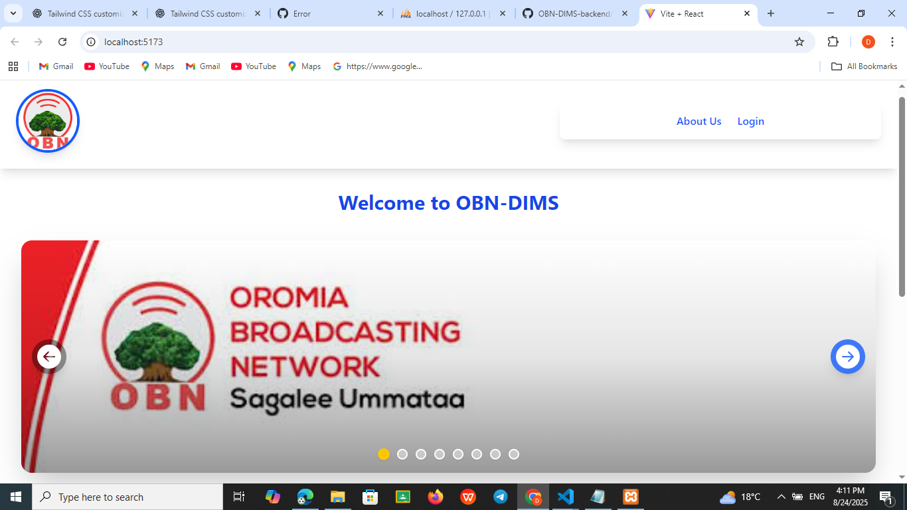

# 🖥️ OBN Digital Infrastructure Management System (ODIMS) – Frontend

ODIMS is a web-based inventory and device management system designed for Oromia Broadcasting Network (OBN). It helps manage devices, track inventory status, generate reports, and assign roles such as Admin and Engineer.

This repository contains the **frontend** built using **React + Vite**.

---

## 📂 Features

- 🔐 Role-based Access (Admin, Engineer, End-User)
- 📋 Device Registration and Inventory Tracking
- 🛠️ Engineer and End-user Issue Reporting
- 🧾 Report Generation (Printable + Exportable)
- 📢 Announcements and Notifications
- 🎯 Dashboard with Statistics and Search
- 📷 QR Code Device Info
- 📱 Responsive Design
## 🖼️ Screenshots
### 🔧 Home Page


### 📋 Login Page


### 🔧 Device Detail


### 📋 Users Page


### 🔧 Report Dashboard


### 📋 Enginer Device Page


### 🔧 QRCode of Device


### 🔧 Notifications Page


### 📋 Announcements Page


### 🔧 Issue Report Page


### 📋 Track Your Issues


---

## ⚙️ Technologies Used

- **Frontend**: React, Vite, JavaScript
- **Styling**: Bootstrap, Tailwind (optional), Custom CSS
- **Printing/Export**: `window.print`
- **Backend**: PHP + MySQL (in separate repo)
- **QR Code**: `qrcode.react`

---

## 🚀 Getting Started (Clone & Run Locally)

### 📁 1. Clone this repository

```bash
git clone https://github.com/dago-o/OBN-Digital-Infrastructure-Management-System-DIMS-.git
cd OBN-Digital-Infrastructure-Management-System-DIMS-


### 📦 2. Install dependencies

Make sure you have Node.js and npm installed.
npm install

### 🏃 3. Run the development server
npm run dev
The app will be available at: http://localhost:5173


## 🔗 Connecting to Backend (PHP API)
The backend for ODIMS is built using PHP and should be cloned and placed in your server root (e.g. htdocs for XAMPP).

Backend Repository: https://github.com/dago-o/OBN-DIMS-backend.git

### 📁 1. Clone backend repo
⚠️ Important:
Make sure you have folder path like below in the htdocs folder:
"C:\xampp\htdocs\projects_and_practices\projects\OBN_project"

cd C:\xampp\htdocs\projects_and_practices\projects\OBN_project
git clone https://github.com/dago-o/OBN-DIMS-backend.git

### 2. Setup database

Create a MySQL database (e.g. obn_dims)

Import the provided .sql file into phpMyAdmin

Update the database credentials in your backend PHP files (connection.php or config.php)

### 3. Start Apache and MySQL (XAMPP)

Ensure XAMPP (or your server) is running so that the frontend can send requests to the backend.

### Check the Backend Repository for the Detail steps


👨‍💻 Author

Degefa Lemma Gadisa
Developer & Designer
Oromia Broadcasting Network (OBN)

🤝 Contributions

Contributions are welcome!
Please open an issue or pull request to suggest improvements or bug fixes.


